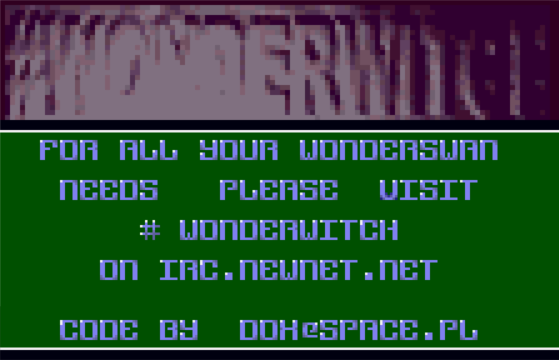

# Retro-WonderSwanColor-Promo
# Promo intro
#wonderwicth irc channel promo intro
## Tech Infos
* Wonderswan Color
* NEC V30MZ 16 bit CPU (80186 compatible) 
* Pure assembler code
## Screenshot

## Build instruction
* Compiler: FASM
* Use com2ws tool to build Wondermagic-compatible cartridge image

## Authors
* **Tomasz Słanina** - [dox](https://github.com/tslanina)
## License
This project is licensed under the MIT license
